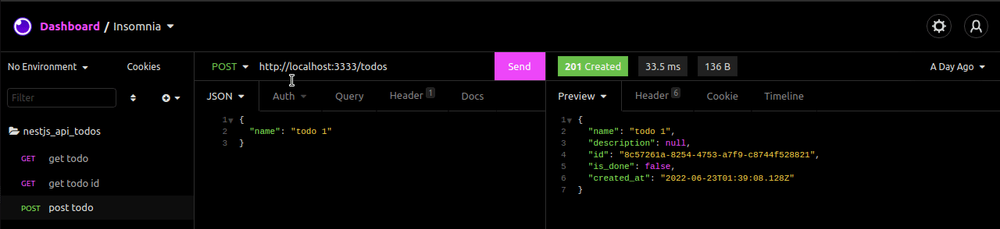

# 📃 Api of Todos

Api created by NestJS with operations crud. 

## 💡 Project and endpoints

Import file called endpoints_nest_jwt.json in your insomnia or postman.

<div align="center" >
  
</div>


## Run Locally

Clone the project

```bash
  git clone https://github.com/thurdelima/nestjs-api-todos
```

Go to the project directory

```bash
  cd nestjs-api-todos
```

Install dependencies

```bash
  npm install 
```

Configure .ENV vars

And

```bash
  npm run start:dev

```


<br/>

<h4 align="center">
  

Made with ♥   by Arthur Lima :wave: [Get in touch!](https://www.linkedin.com/in/arthur-lima-294ab0103/)
</h4>

